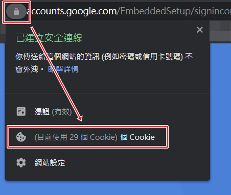
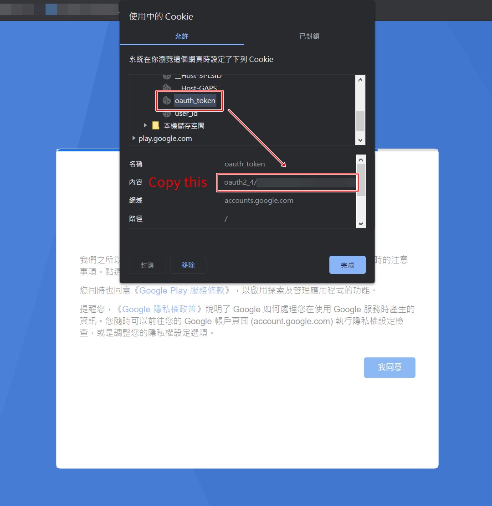

# Google Play API (Node.js Library)

English | [繁體中文](README_ZH-TW.md)

Access Google Play by logging in and making requests as an Android device!

A version of this library for PHP is being developed.

## Report Issues

Please report any bugs you discover at <https://github.com/GoneToneStudio/node-google-play-api/issues>

## Installation

Node.js 14.0.0 or newer is required.

### With NPM

```sh-session
npm install @gonetone/google-play-api
```

## Obtain an OAuth2 Token

- Navigate to <https://accounts.google.com/EmbeddedSetup>
- Sign in with your Google account
- Select "I agree"
- Navigate to "Cookie"
  
  
  
- Expand accounts.google.com > Cookie, find "oauth_token", and select the value beginning with `oauth2_4/`
  
  

## Obtain the GSF ID of your device (Google Service Framework ID)

You can install the "Device ID" APP on Google Play to obtain the GSF ID of your device: <https://play.google.com/store/apps/details?id=tw.reh.deviceid>

Please note:

- The device which you get the GSF ID from will affect the subsequent data of the application. If the application which you want to get data from doesn’t support the device you get the GSF ID from, the data will return null. Thus, make sure whether the application supports your device.
- Android TV cannot download the "Device ID" APP directly from Google Play. Nevertheless, you can download it on other devices and backup as .APK file, then, transfer the .APK file to Android TV to complete your installation.

## Examples

```javascript
const GooglePlayAPI = require('@gonetone/google-play-api')
```

### Using GooglePlayAPI

```javascript
const gpAPI = new GooglePlayAPI("Your_Google_Account@gmail.com", "The GSF ID (Google Service Framework ID) of your device")
```

### Configuring User-Agent (Optional)

```javascript
gpAPI.setUserAgent('User-Agent')
```

### Configuring Client ID (Optional)

```javascript
gpAPI.setClientID('am-android-asus')
```

### Configuring SDK Version (Optional)

```javascript
gpAPI.setSdkVersion(28)
```

### Configuring Country Code (Optional)

```javascript
gpAPI.setCountryCode('tw')
```

### Configuring Language Code (Optional)

```javascript
gpAPI.setLanguageCode('zh-TW')
```

### Get App Details

```javascript
gpAPI.getGoogleToken('Your OAuth2 Token', 'save/token.txt').then(async (token) => {
  await gpAPI.googleAuth(token)

  const details = await gpAPI.appDetails('com.github.android')

  console.log(`Title: ${details.title}`)
  console.log(`Description Html: ${details.descriptionHtml}`)
  console.log(`Developer Name: ${details.details.appDetails.developerName}`)
  console.log(`Version Code: ${details.details.appDetails.versionCode}`)
  console.log(`Version String: ${details.details.appDetails.versionString}`)
  console.log(`Package Name: ${details.details.appDetails.packageName}`)
  console.log(`Share Url: ${details.shareUrl}`)
  
  console.log(details)
})
```

### Get Bulk Details

```javascript
gpAPI.getGoogleToken('Your OAuth2 Token', 'save/token.txt').then(async (token) => {
  await gpAPI.googleAuth(token)

  const bulkDetails = await gpAPI.bulkDetails('com.github.android', 'com.twitter.android', 'com.facebook.katana')
  console.log(bulkDetails)
})
```

### App Search

```javascript
gpAPI.getGoogleToken('Your OAuth2 Token', 'save/token.txt').then(async (token) => {
  await gpAPI.googleAuth(token)

  const search = await gpAPI.search('GitHub')
  console.log(search)
})
```

### Get Download Info

```javascript
gpAPI.getGoogleToken('Your OAuth2 Token', 'save/token.txt').then(async (token) => {
  await gpAPI.googleAuth(token)

  const downloadInfo = await gpAPI.downloadInfo('com.github.android')
  //const downloadInfo = await gpAPI.downloadInfo('com.github.android', 613) // Specify Version Code

  console.log(downloadInfo)
})
```

### Get Download Apk Url

```javascript
gpAPI.getGoogleToken('Your OAuth2 Token', 'save/token.txt').then(async (token) => {
  await gpAPI.googleAuth(token)

  const downloadApkUrl = await gpAPI.downloadApkUrl('com.github.android')
  //const downloadApkUrl = await gpAPI.downloadApkUrl('com.github.android', 613) // Specify Version Code

  console.log(downloadApkUrl)
})
```

### Download Apk

```javascript
gpAPI.getGoogleToken('Your OAuth2 Token', 'save/token.txt').then(async (token) => {
  await gpAPI.googleAuth(token)

  await gpAPI.downloadApk('com.github.android', 'save_folder')
  //await gpAPI.downloadApk('com.github.android', 'save_folder', 613) // Specify Version Code
})
```

### Get Split Delivery Data Info

```javascript
gpAPI.getGoogleToken('Your OAuth2 Token', 'save/token.txt').then(async (token) => {
  await gpAPI.googleAuth(token)

  const splitDeliveryDataInfo = await gpAPI.splitDeliveryDataInfo('com.supercell.clashofclans')
  //const splitDeliveryDataInfo = await gpAPI.splitDeliveryDataInfo('com.supercell.clashofclans', 1383) // Specify Version Code

  console.log(splitDeliveryDataInfo)
})
```

### Get Download Split Apks Name And Url

```javascript
gpAPI.getGoogleToken('Your OAuth2 Token', 'save/token.txt').then(async (token) => {
  await gpAPI.googleAuth(token)

  const downloadSplitApksNameAndUrl = await gpAPI.downloadSplitApksNameAndUrl('com.supercell.clashofclans')
  //const downloadSplitApksNameAndUrl = await gpAPI.downloadSplitApksNameAndUrl('com.supercell.clashofclans', 1383) // Specify Version Code

  console.log(downloadSplitApksNameAndUrl)
})
```

### Download Split Apks

```javascript
gpAPI.getGoogleToken('Your OAuth2 Token', 'save/token.txt').then(async (token) => {
  await gpAPI.googleAuth(token)

  await gpAPI.downloadSplitApks('com.supercell.clashofclans', 'save_folder')
  //await gpAPI.downloadSplitApks('com.supercell.clashofclans', 'save_folder', 1383) // Specify Version Code
})
```

PS:

- You can use [Split APKs Installer (SAI)](https://play.google.com/store/apps/details?id=com.aefyr.sai) this app to install split apks.
- Don’t forget to use `gpAPI.downloadApk()` to download the main apk, then install together.

### Get Additional File Info

```javascript
gpAPI.getGoogleToken('Your OAuth2 Token', 'save/token.txt').then(async (token) => {
  await gpAPI.googleAuth(token)

  const additionalFileInfo = await gpAPI.additionalFileInfo('com.github.android')
  //const additionalFileInfo = await gpAPI.additionalFileInfo('com.github.android', 613) // Specify Version Code

  console.log(additionalFileInfo)
})
```

### Get Download Additional File Urls

```javascript
gpAPI.getGoogleToken('Your OAuth2 Token', 'save/token.txt').then(async (token) => {
  await gpAPI.googleAuth(token)

  const downloadAdditionalFileUrls = await gpAPI.downloadAdditionalFileUrls('com.github.android')
  //const downloadAdditionalFileUrls = await gpAPI.downloadAdditionalFileUrls('com.github.android', 613) // Specify Version Code

  console.log(downloadAdditionalFileUrls)
})
```

### Download Additional Files

```javascript
gpAPI.getGoogleToken('Your OAuth2 Token', 'save/token.txt').then(async (token) => {
  await gpAPI.googleAuth(token)

  await gpAPI.downloadAdditionalFiles('com.github.android', 'save_folder')
  //await gpAPI.downloadAdditionalFiles('com.github.android', 'save_folder', 613) // Specify Version Code
})
```

## License

[MIT](LICENSE)
